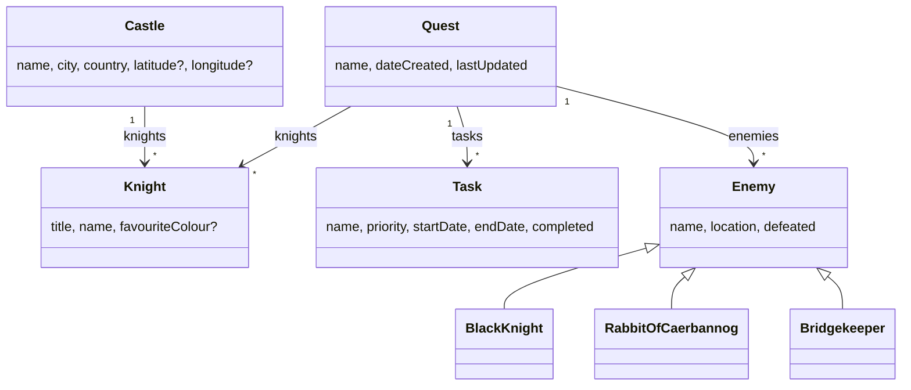

# The Quest for the Holy Grails

<div class="pt-12">
  <span class="text-xl opacity-75">
    A Grails 7 Tutorial
  </span>
</div>

<div class="pt-8 text-sm opacity-60">
  Community Over Code · Glasgow · 12 October 2026
</div>

<div class="abs-br m-4 text-xs opacity-50">
  Doune Castle, a.k.a. Camelot · photo: Bill Boaden, CC BY-SA 2.0, via geograph.org.uk / Wikimedia Commons
</div>

<!--
40 minutes. Three beats: build the domain, one service one test, what changed in 7.
Everything shown is in the repo, tagged per stage. Live-code only what is marked LIVE in the notes.
-->

---

# Contact Info

Ken Kousen<br>
Kousen IT, Inc.

- ken.kousen@kousenit.com
- http://www.kousenit.com
- http://kousenit.org (blog)
- Social Media:
  - [@kenkousen](https://twitter.com/kenkousen) (Twitter)
  - [@kousenit.com](https://bsky.app/profile/kousenit.com) (Bluesky)
  - [kenkousen.substack.com](https://kenkousen.substack.com) (Tales from the jar side)

---

# The Quest

A complete Grails 7 application, built in stages, with a lab guide

<div class="grid grid-cols-2 gap-8 pt-4">
<div>

**Three beats, forty minutes**

1. Build the domain
2. One service, one test
3. What changed in Grails 7

</div>
<div>

**Take it home**

- `github.com/kousen/holygrails7`
- `labs.md`: twelve labs, one tag each
- `git checkout step5-model` to join at any point
- `main` is the finished app

</div>
</div>

<div class="pt-8 text-sm opacity-70">
Ran this course in 2012 on Grails 2, in 2018 on Grails 3.3, and in 2021 on Grails 5.0.
Same knights. New framework. Same jokes.
</div>

---

# Why Monty Python?

Because a domain model should be memorable, and this one does structural work

| Domain class | Feature it carries |
|---|---|
| `Quest` has many `Task`s | one-to-many, cascading delete, timestamps |
| `Task` priority 1..5, end after start | range and custom validators |
| `Knight` favourite colour | a validator with an exception for Galahad |
| `Castle` with coordinates | a service, an external API, a map |
| `Enemy` → `BlackKnight`, `RabbitOfCaerbannog`, `Bridgekeeper` | inheritance mapping |

The castles are the filming locations. Doune Castle was Camelot. It is an hour from here.

---
layout: section
---

# Grails 7 at a glance

---

# The first ASF release

Grails 7.0.0 shipped 28 October 2025, the first release as an Apache top-level project

| | Grails 6 | Grails 7.2.4 |
|---|---|---|
| Java | 11+ | **17+** |
| Groovy | 3.0 | **4.0.33** |
| Spring Boot | 2.7 | **3.5.16** |
| Spring Framework | 5.3 | **6.2.19** |
| Servlet API | `javax.*` | **`jakarta.*`** |
| Gradle | 7.6 | **8.14.5** |

Group id for everything: `org.apache.grails`, versioned by one BOM.

<!--
Hibernate did NOT move: still 5.6.15, the jakarta build. That surprises people. Hibernate 7 is Grails 8.
-->

---

# Grails Forge

The generator moved to `grails.apache.org/start`, and it has an API

```bash
curl -L -o app.zip \
  "https://latest.grails.org/create/web/com.kousenit.holygrails?jdkVersion=JDK_21&gorm=HIBERNATE&test=SPOCK&features=testcontainers"
```

What you get:

```
build.gradle            Grails BOM + Gradle plugins, no versions on dependencies
grails-app/             conf, controllers, domain, services, views, init, i18n
src/test/groovy         unit tests
src/integration-test    integration and functional tests
grailsw, gradlew        wrappers; nothing to install
```

Commit it before you touch it. Every later diff is yours.

---

# `grails run-app`

```
       holygrails7: 0.1 | JVM: Eclipse Adoptium 21.0.8 | Grails: 7.2.4
            Groovy: 4.0.33 | Spring Boot: 3.5.16 | Spring: 6.2.19
Grails application running at http://localhost:8080 in environment: development
```

- The banner is new in 7; the versions in it are 7.1
- `run-app` and `./gradlew bootRun` are the same embedded Tomcat
- The `grails` command delegates to Gradle now. Watch for `CONFIGURE SUCCESSFUL`

<!--
Show the starter running: tag step0-starter. 2 minutes.
-->

---
layout: section
---

# Beat one: build the domain

---

# A domain class

```bash
grails create-domain-class Quest
```

```groovy
package com.kousenit

class Quest {
    String name

    String toString() { name }

    static constraints = {
        name blank: false
    }
}
```

- `grails-app/domain`: GORM adds `id`, `version`, persistence, validation
- Every property is non-nullable unless you say otherwise
- Constraints are a DSL; the scaffolding reads them to build forms

<!--
LIVE: type this class. Then generate-all. ~4 minutes to the running list page.
-->

---

# `generate-all`

```bash
grails generate-all com.kousenit.Quest
```

| File | Lines | What |
|---|---|---|
| `QuestController.groovy` | 99 | index, show, create, save, edit, update, delete |
| `QuestService.groovy` | 17 | a GORM **data service**: an interface GORM implements |
| `views/quest/*.gsp` | 4 files | Fields plugin, Bootstrap 5.3 |
| `QuestControllerSpec.groovy` | | unit test skeleton |
| `QuestServiceSpec.groovy` | | integration test skeleton |

---

# A data service is an interface

```groovy
@Service(Quest)
interface QuestService {
    Quest get(Serializable id)
    List<Quest> list(Map args)
    Long count()
    void delete(Serializable id)
    Quest save(Quest quest)
}
```

- GORM reads the method names and generates the implementation at compile time
- Every method is transactional
- The controller gets it by property name: `QuestService questService`
- Add your own: `List<Quest> findAllByNameLike(String pattern)` is enough; GORM writes the body

---

# The skeletons fail on purpose

```groovy
def populateValidParams(params) {
    assert params != null
    // TODO: Populate valid properties like...
    //params["name"] = 'someValidName'
    assert false, "TODO: Provide a populateValidParams() implementation for this generated test suite"
}
```

Three red tests after every `generate-all`, so you cannot forget them.

<div class="pt-4">

Also: a blank name reports **cannot be null**, not blank. Data binding trims and converts `""` to `null` before validation.

```yaml
grails:
  databinding:
    convertEmptyStringsToNull: false
```

```properties
quest.name.blank=Quests must have a name
```

Message key pattern: `className.propertyName.constraint`

</div>

---

# A related class

```groovy
class Task {
    String name
    int priority = 3
    LocalDate startDate = LocalDate.now()
    LocalDate endDate = LocalDate.now()
    boolean completed

    String toString() { name }

    static belongsTo = [quest: Quest]

    int getDuration() { (endDate - startDate) + 1 }

    static constraints = {
        name blank: false
        priority range: 1..5
        endDate validator: { LocalDate value, Task task ->
            value >= task.startDate
        }
    }
}
```

<!--
LIVE: the validator. belongsTo = owning side, cascade delete. getDuration is derived: no transients needed in 7.
endDate - startDate: see next slide.
-->

---

# Groovy 4 is modular

`endDate - startDate` does not compile in a fresh Grails 7 app

<div class="grid grid-cols-2 gap-8">
<div>

Grails ships:

- `groovy`
- `groovy-json`
- `groovy-sql`
- `groovy-templates`
- `groovy-xml`

</div>
<div>

Grails does not ship:

- `groovy-datetime`
- (`groovy-console` arrives via the `console` configuration)

</div>
</div>

```groovy
implementation "org.apache.groovy:groovy-datetime"   // version from the Groovy BOM
```

You get `date - date`, `date + 1`, `date.format('MMM d')`, and date ranges back.

---

# Test by error code

```groovy
class TaskSpec extends Specification implements DomainUnitTest<Task> {

    @Shared Quest quest = new Quest(name: 'Seek the grail')
    Task task = new Task(name: 'Defeat the Black Knight', quest: quest)

    void "priorities above 5 are not valid"() {
        when:
        task.priority = 6

        then:
        !task.validate()
        task.errors['priority'].code == 'range.toobig'
    }
}
```

- `DomainUnitTest`: GORM without a database
- `@Shared` for the fixture nobody mutates; a plain field is rebuilt for every feature
- The error codes (`blank`, `nullable`, `range.toobig`, `validator.invalid`) are your message keys

---

# One test, five cases

```groovy
    @Unroll
    void "a task with priority #priority is valid"() {
        when:
        task.priority = priority

        then:
        task.validate()

        where:
        priority << (1..5)
    }
```

The report lists *a task with priority 1 is valid* through *a task with priority 5 is valid*. Change the range to `1..4` and watch which one fails.

---

# Seed data

```groovy
static Quest seekTheGrail() {
    LocalDate today = LocalDate.now()
    new Quest(name: 'Seek the grail')
        .addToTasks(name: 'Run away from killer rabbit', priority: 1)
        .addToTasks(name: 'Answer the Bridgekeeper', priority: 4, startDate: today + 1, endDate: today + 1)
        .addToTasks(name: 'Defeat the Black Knight', completed: true, startDate: today - 3, endDate: today - 2)
        .addToTasks(name: 'Bring out your dead', completed: true, priority: 5)
        .addToTasks(name: 'Find a shrubbery for the Knights Who Say Ni', priority: 2, endDate: today + 7)
        .addToTasks(name: 'Weigh a witch against a duck', priority: 3)
        .addToTasks(name: 'Lobbeth the Holy Hand Grenade of Antioch', priority: 5, startDate: today + 2)
        .save(failOnError: true)
}
```

```groovy
class BootStrap {
    def init = { servletContext ->
        if (Environment.current != Environment.TEST && Quest.count() == 0) {
            Quest quest = SeedData.seekTheGrail()
            SeedData.theCourt(quest)
        }
    }
}
```

`failOnError: true`: `save()` returns `null` on bad data by default. In startup code, throw.

---

# Three ways to ask

```groovy
// dynamic finders: methods derived from the name
Task.findAllByPriorityLessThanAndStartDateBetween(4, today - 1, today + 1)
Task.countByCompletedAndPriorityGreaterThan(false, 3)

// criteria: a builder, composable at runtime, joins by nesting
Quest.withCriteria {
    tasks {
        eq 'completed', false
        eq 'priority', 5
    }
}

// where queries: compile-time checked, lazy, composable
def open = Task.where { completed == false }
def overdue = open.where { endDate < today }
overdue.count()
```

<!--
LIVE: run QuestQueriesSpec, show two finders. The console still exists in 7, but a test is a better tutorial medium.
-->

---

# `@Rollback` and `setup()` do not mix

```groovy
@Integration
@Rollback
class QuestQueriesSpec extends Specification {

    // Not setup(): with @Rollback, setup() runs BEFORE the transaction begins,
    // so anything it saves is committed and leaks into the other tests.
    private void seed() { SeedData.seekTheGrail() }

    void "dynamic finders are built from property names"() {
        seed()

        expect:
        Task.findAllByCompleted(true).size() == 3
    }
}
```

The generated service specs call `setupData()` inside every feature for exactly this reason.

For tests that *must* commit (browser tests, HTTP tests): `@DatabaseCleanup`. Later.

---

# The whole model



`Task` and `Enemy` use `belongsTo`; `Knight` holds plain references, because knights wander.

---

# The Bridge of Death

"What... is your favourite colour?" "Blue. No, yel—" *aaaargh*

```groovy
class Knight {
    String title = 'Sir'
    String name
    String favouriteColour

    static constraints = {
        title inList: ['Sir', 'Lord', 'Lady', 'King', 'Queen']
        name blank: false
        favouriteColour nullable: true, validator: { String colour, Knight knight ->
            // The Bridgekeeper asks every knight. Only Galahad is allowed not to know.
            if (!colour && !knight.name.contains('Galahad')) {
                return 'bridgeOfDeath'
            }
        }
    }
}
```

Return a `String` from a validator and it becomes the error code: `knight.favouriteColour.bridgeOfDeath`.
Validators run for `null`; `nullable: true` only disables the built-in check.

---
layout: section
---

# `@Scaffold`

---
layout: two-cols
---

# Before

`generate-all com.kousenit.Castle`

- `CastleController.groovy`: 99 lines
- `CastleService.groovy`: 17 lines
- four GSP files
- a 14-test controller spec

**535 lines**, none of them written by you, all of them yours to maintain.

```groovy
def save(Castle castle) {
    if (castle == null) { notFound(); return }
    try {
        castleService.save(castle)
    } catch (ValidationException e) {
        respond castle.errors, view:'create'
        return
    }
    request.withFormat { /* ... */ }
}
```

::right::

# After

`generate-scaffold-all com.kousenit.Castle`

```groovy
@Scaffold(RestfulServiceController<Castle>)
class CastleController {}
```

```groovy
@Scaffold(Castle)
class CastleService {
}
```

**10 lines.** Views are generated at runtime from the same templates.

```bash
curl -H "Accept: application/json" \
  localhost:8080/castle/show/1
```

```json
{"id":1,"name":"Camelot","city":"Doune",
 "country":"Scotland","latitude":56.1853,
 "longitude":-4.0509,"knights":[{"id":1},...]}
```

JSON comes free.

<!--
LIVE: delete the generated files, run generate-scaffold-all, restart, show /castle and the curl. Headline moment, ~5 minutes.
-->

---

# How `@Scaffold` works

- A compile-time **AST transformation**: the empty class really becomes a `RestfulController<Castle>` or a `GormService<Castle>` subclass

```groovy
class CastleControllerSpec extends Specification implements ControllerUnitTest<CastleController> {
    void "the annotation turns an empty class into a RestfulController"() {
        expect:
        controller instanceof RestfulController
        controller.resource == Castle
    }
}
```

- `@Scaffold(Castle)` on a controller talks to the domain class directly; `@Scaffold(RestfulServiceController<Castle>)` goes through the service bean
- `@Scaffold(domain = Castle, readOnly = true)` for reference data
- Views: `generate-views` to take over one page, the rest stay dynamic
- Actions: add your own, or override one and call the protected helpers (`listAllResources`, `countResources`)

---
layout: section
---

# Beat two: one service, one test

---

# A service

```bash
grails create-service Geocoder
```

```groovy
class GeocoderService {

    static final String BASE = 'https://geocoding-api.open-meteo.com/v1/search'

    Castle fillInLatLng(Castle castle) {
        Map place = lookup(castle.city)
        if (place) {
            castle.latitude = place.latitude as Double
            castle.longitude = place.longitude as Double
        }
        castle
    }

    Map lookup(String city) {
        String url = "$BASE?name=${URLEncoder.encode(city, 'UTF-8')}&count=1"
        Map response = new JsonSlurper().parse(url.toURL()) as Map
        (response.results as List<Map>)?.find()
    }
}
```

Open-Meteo: free, no key, JSON. Two methods, because only one of them touches the network.

<!--
LIVE: write fillInLatLng, run the Spy test. The 2012 version called Google's XML API without a key. Those days are gone.
-->

---

# Test it without the network

```groovy
class GeocoderServiceSpec extends Specification
        implements ServiceUnitTest<GeocoderService>, DomainUnitTest<Castle> {

    Castle camelot = new Castle(name: 'Camelot', city: 'Doune', country: 'Scotland')

    void "coordinates are copied from the first result"() {
        given: 'a service whose lookup never touches the network'
        GeocoderService geocoder = Spy(GeocoderService) {
            lookup('Doune') >> [name: 'Doune', latitude: 56.18995, longitude: -4.05288]
        }

        when:
        geocoder.fillInLatLng(camelot)

        then:
        camelot.latitude == 56.18995d
        camelot.validate()
    }
}
```

A Spock **Spy** runs the real `fillInLatLng` with a stubbed `lookup`.

---

# And once with the network

```groovy
@Integration
@IgnoreIf({ env.OFFLINE })
class GeocoderServiceLiveSpec extends Specification {

    GeocoderService geocoderService

    void "Doune is where we left it"() {
        when:
        Map place = geocoderService.lookup('Doune')

        then:
        place.country == 'United Kingdom'
        (place.latitude - 56.19).abs() < 0.05
    }
}
```

```bash
OFFLINE=1 ./gradlew integrationTest    # conference wifi mode
```

---

# Wire it in

The `@Scaffold` service is a real `GormService` subclass. Override `save`:

```groovy
@Scaffold(Castle)
class CastleService {

    GeocoderService geocoderService      // injected by name, no annotation

    @Override
    Castle save(Castle castle) {
        if (castle.latitude == null || castle.longitude == null) {
            geocoderService.fillInLatLng(castle)
        }
        super.save(castle)
    }
}
```

Seed castles arrive with coordinates, so startup never touches the network. Castles from the form get geocoded.

---

# The payoff


Leaflet from a **webjar** (`org.webjars.npm:leaflet:1.9.4`, served at `/webjars/**` with no config), OpenStreetMap tiles, markers from a model entry added by one overridden action.

---
layout: section
---

# Beat three: what changed in 7

---

# Coordinates

Everything the Grails team publishes moved to `org.apache.grails`, with one BOM

| Grails 6 | Grails 7 |
|---|---|
| `org.grails:grails-core` | `org.apache.grails:grails-core` |
| `org.grails.plugins:hibernate5` | `org.apache.grails:grails-data-hibernate5` |
| `org.grails.plugins:spring-security-core:6.1.1` | `org.apache.grails:grails-spring-security` |
| `org.grails.plugins:quartz:2.0.13` | `org.apache.grails:grails-quartz` |
| `com.bertramlabs.plugins:asset-pipeline-grails` | `cloud.wondrify:asset-pipeline-grails` |

- `RENAME.md` in grails-core has the full map; `etc/bin/rename_gradle_artifacts.sh` applies it
- `gradle.properties`: `grailsVersion` is the only version you set
- Spring Security and Quartz plugins now live in core and share the Grails version

---

# Build and tooling

- **Micronaut is out** of the default stack. Grails 4 to 6 ran it as the parent context; 7 removes it. `grails-micronaut` is opt-in.
- **Gradle 8.14.5**, parallel, lazy, cacheable. Gradle 9 is **not** supported by the 7.x plugins.
- **The classic CLI and `grailsw` are back**, and they delegate to Gradle. `console` and `schema-export` survive.
- **Forge** generates projects; the CLI scaffolds inside them.
- Groovy 4's invokedynamic is disabled by default for Grails compiles (`grails { indy = true }` to re-enable).
- Test dependencies are off the production classpath.
- `stop-app` uses a PID file, not JMX.
- Reproducible builds: set `SOURCE_DATE_EPOCH`.

---

# Testing

- **`ContainerGebSpec`**: functional tests in a browser that Testcontainers starts in Docker. Extend it instead of `GebSpec`; nothing else to configure.

```groovy
@Integration
@DatabaseCleanup
class CastleMapSpec extends ContainerGebSpec {
    void 'the castle list shows every castle on the map'() {
        when:
        go '/castle'

        then:
        waitFor { $('#map .leaflet-marker-icon').size() == 3 }
    }
}
```

- **`@DatabaseCleanup`**: truncate after each test, for tests that commit (plus `grails-testing-support-dbcleanup-h2`)
- **`HttpClientSupport`** (7.1): `http('/api/quests').assertStatus(200)`, `httpPostJson(...)`, `response.json()`
- **Custom test phases** (7.1): `testPhases { functionalTest { } }`

<!--
Mattias has the Geb deep dive. Hand off.
-->

---

# Also new

- **`@Scaffold`** and the `*-scaffold-*` commands (7.1)
- **Audit annotations** (7.1): `@CreatedDate`, `@LastModifiedDate`, `@CreatedBy`, `@LastModifiedBy`; `@AutoTimestamp` deprecated for 8
- **External configuration** built in: the old external-config plugin, no plugin needed
- **GSP**: `formActionSubmit` replaces `actionSubmit`; `g:form` adds a CSRF token under Spring Security; `g:flashMessages`; Bootstrap 5.3 in scaffolding and Fields
- **URL mappings** (7.1): `group` defaults; `$id+` greedy matching keeps dots in the id
- **JSON dates** are ISO-8601 everywhere, including `java.util.Date`. Clients that parsed epoch millis need updating
- **SiteMesh 3** (7.2): decoration by a view resolver, so async controllers render correctly
- **The banner**

---

# Upgrading from 5 or 6

1. Generate a fresh 7.2.4 app from Forge with your features. Diff `build.gradle`, `gradle.properties`, `application.yml`. Many old settings are now plugin defaults.
2. Java 17 or 21. Gradle 8.14.x.
3. Run the rename script. Delete the versions the BOM manages.
4. `javax` → `jakarta`. The Nebula `jakartaee-migration` plugin helps for big codebases.
5. Every pre-7 plugin needs a 7 release.
6. Used Micronaut? Add `grails-micronaut`. Otherwise enjoy the smaller build.
7. Groovy 4 changes: primitive `boolean` properties only get `isX()`; `DELEGATE_FIRST` resolution order changed; public fields now show up as properties.
8. Run the tests. Then run them in a container.

---
layout: section
---

# Lessons from building this

---

# Four things that will bite you

<div class="text-sm">

**Grails 7 + Java 25 + IntelliJ does not work.** Grails 7.2 is pinned to Gradle 8.14, which officially supports Java 24 at most. The build runs on 25 from the command line; IntelliJ enforces Gradle's table and refuses to sync. Use 21. Grails 8 is on Gradle 9.8.

**`groovy-datetime` is not on the classpath.** Any `date - date` from older code fails until you add one dependency line.

**Apple silicon breaks the Geb test out of the box.** `selenium/standalone-chrome` is amd64 only; Chrome dies under emulation. Five lines of `GebConfig.groovy` switch to Firefox's arm64 image:

```groovy
driver = { new RemoteWebDriver(new FirefoxOptions()) }
containerBrowser = 'firefox'
```

**The Gradle configuration cache** in `~/.gradle/gradle.properties` breaks `buildProperties`. A project property cannot override it; mark the task `notCompatibleWithConfigurationCache` in `build.gradle`.

</div>

---

# Three things worth knowing

- **Generated test skeletons fail on purpose.** `assert false` with a TODO, in every spec `generate-all` writes.
- **`setup()` runs before `@Rollback`'s transaction.** Seed inside the feature method. Use `@DatabaseCleanup` when the test must commit.
- **Where-query closures inside Spock `expect:` blocks** did not get transformed in my tests; `Task.findAll { priority in [1, 5] }` returned everything. Assign in `when:`, assert in `then:`.

<div class="pt-6 opacity-80">

And three things that turned out to be rumours: there is no SBOM feature, the console is not dead, and Hibernate did not move.

</div>

---

# Grails 8 is next

Tagged 4 October 2026, pre-release as of this talk

| | Grails 7.2 | Grails 8.0 |
|---|---|---|
| Java | 17 to 24 | **21** to **25** |
| Groovy | 4.0 | **5.1** |
| Spring Boot / Framework | 3.5 / 6.2 | **4.1 / 7.0** (Jackson 3, Tomcat 11) |
| Hibernate | 5.6 | 5.6, or **7** via Forge |
| Spock | 2.3 | **2.4** |
| Gradle | 8.14 | **9.8** |

The upgrade from 7 is designed to be incremental. Get to 7 first.

<!--
James's talk at 17:00 covers 8 properly. One line and hand off.
-->

---

# Community over code

Three issues I would file after this week, and this is the conference to say so

1. **grails-geb**: mark the Chromium image as a Chrome substitute, or default to a multi-arch image on arm64 hosts
2. **The upgrade guide**: two headings have their version numbers swapped, and several Grails 7 sections sit under the Grails 5 to 6 chapter
3. **Forge**: the JDK 25 option generates a build IntelliJ will not open

<div class="pt-6">

Two days of training in 2012. Ten minutes of prompting now. The Grails 8 release notes credit an AI account among the contributors and ship an upgrade skill.
The framework's own maintainers are working the way this morning's talk described.

</div>

---

# Resources

- This talk: `github.com/kousen/holygrails7`, start with `labs.md`
- Grails 7.2.4 guide: https://grails.apache.org/docs/7.2.4/guide/
  - *What's new*: `introduction.html#whatsNew`
  - *Upgrading*: `upgrading.html`
- Grails Forge: https://grails.apache.org/start
- `RENAME.md` and the rename script: `github.com/apache/grails-core`
- Geb plugin README: `grails-core/grails-geb/README.md`
- Open-Meteo geocoding: https://open-meteo.com/en/docs/geocoding-api
- Leaflet: https://leafletjs.com
- Doune Castle: https://www.historicenvironment.scot/visit-a-place/places/doune-castle/

---
layout: center
class: text-center
---

# Thank you

Questions?

<div class="pt-8 opacity-70">
"We are the Knights Who Say... Ni!"
</div>
